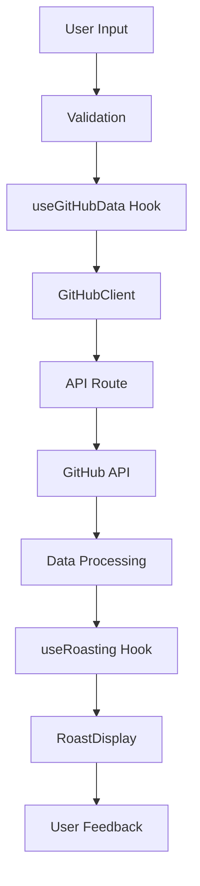

# 🏗️ Roastivator Architecture Documentation

## 📁 Project Structure

```
roastivator/
├── src/
│   ├── app/              # Next.js App Router (routes & layouts only)
│   │   ├── api/          # Next.js API routes
│   │   │   └── github/   # GitHub proxy endpoints
│   │   ├── page.tsx      # Homepage
│   │   ├── layout.tsx    # Root layout
│   │   ├── globals.css   # Global styles
│   │   └── not-found.tsx # 404 page
│   ├── components/       # Reusable React components
│   │   ├── providers/    # Context providers & app-wide providers
│   │   ├── ui/          # Reusable UI components
│   │   └── github/      # GitHub-specific business components
│   ├── hooks/           # Custom React hooks
│   ├── lib/             # Business logic & utility classes
│   ├── utils/           # General utility functions
│   ├── types/           # TypeScript type definitions
│   ├── constants/       # Application constants & configuration
│   └── __tests__/       # Test files
├── public/              # Static assets
├── docs/                # Documentation
└── ...config files      # Configuration files
```

## 🧱 Core Components Architecture

### 1. **Separation of Concerns**

- **Components**: Pure UI components with minimal business logic
- **Hooks**: Business logic and state management
- **Lib**: Utility functions and classes
- **Types**: TypeScript definitions for type safety
- **Constants**: Configuration and static data

### 2. **Custom Hooks Pattern**

#### `useGitHubData`
- Manages GitHub API data fetching
- Handles loading states and error management
- Provides clean interface for components
- Includes retry logic and rate limit handling

#### `useRoasting` 
- Encapsulates roasting algorithm logic
- Provides roast generation and analysis
- Calculates severity and category insights
- Memoized for performance

#### `useKeyboard`
- Manages keyboard shortcuts
- Provides accessible navigation
- Customizable key combinations

### 3. **Component Composition**

#### UI Components (`app/components/ui/`)
- **Button**: Polymorphic button with variants, sizes, loading states
- **Input**: Accessible input with validation, icons, error states
- **Card**: Flexible card layout with header, content, footer
- **LoadingSpinner**: Multiple loading variants with animations
- **ErrorBoundary**: Comprehensive error handling with fallback UI

#### Business Components (`app/components/github/`)
- **UserInput**: GitHub username input with validation
- **LoadingState**: Multi-step loading with progress indication
- **RoastDisplay**: Results display with categorized roasts

### 4. **Type Safety**

Comprehensive TypeScript interfaces for:
- GitHub API responses (`GitHubUser`, `GitHubRepo`, `GitHubCommit`)
- Application state (`RoastResult`, `LoadingStep`)
- API responses (`ApiResponse`, `RateLimitInfo`)
- Configuration (`RoastAnalysisConfig`)

### 5. **Error Handling Strategy**

- **Client-side**: Custom `GitHubClientError` class with rate limit info
- **API routes**: Structured error responses with timestamps
- **UI**: Error boundaries with graceful fallbacks
- **Validation**: Input sanitization and validation

### 6. **Performance Optimizations**

- **Memoization**: `useMemo` for expensive computations
- **Debouncing**: Input debouncing for API calls
- **Lazy Loading**: Dynamic imports for non-critical components
- **Caching**: API response caching with Next.js
- **Image Optimization**: WebP/AVIF format support

### 7. **Accessibility Features**

- **Keyboard Navigation**: Full keyboard support
- **Screen Readers**: ARIA labels and live regions
- **Focus Management**: Proper focus trapping
- **Reduced Motion**: Respects user preferences
- **Color Contrast**: WCAG AA compliant colors

## 🔄 Data Flow



## 🧪 Testing Strategy

### Test Structure
- **Unit Tests**: Individual functions and hooks
- **Component Tests**: UI component behavior
- **Integration Tests**: Data flow and API interactions
- **E2E Tests**: Complete user journeys

### Testing Tools
- **Jest**: Test runner and assertion library
- **Testing Library**: Component testing utilities
- **MSW**: API mocking for integration tests

## 🚀 Performance Monitoring

### Built-in Monitoring
- **Performance Marks**: Browser performance API integration
- **Memory Tracking**: Heap size monitoring in development
- **Error Tracking**: Comprehensive error logging

### Metrics Tracked
- Component render times
- API response times
- Memory usage patterns
- Error frequencies

## 🔒 Security Considerations

### Input Validation
- Username format validation
- Input sanitization
- XSS prevention

### API Security
- Rate limiting respect
- CORS handling
- Secure headers

### Content Security
- CSP headers
- SVG sanitization
- Safe external link handling

## 📱 Responsive Design

### Breakpoint Strategy
- Mobile-first approach
- Flexible grid layouts
- Adaptive typography
- Touch-friendly interactions

### Animation Performance
- Hardware acceleration
- Reduced motion support
- Performant transforms
- Optimized re-renders

## 🔧 Configuration Management

### Environment Configuration
- Development vs. production settings
- Feature flags support
- API endpoint configuration
- Rate limiting parameters

### Runtime Configuration
- Roast severity levels
- Analysis parameters
- UI customization options
- Performance thresholds

## 📈 Scalability Considerations

### Code Organization
- Modular architecture
- Clear dependency injection
- Loosely coupled components
- Easy feature extension

### Performance Scaling
- Component memoization
- Efficient re-rendering
- Optimized bundle size
- Progressive loading

### Feature Scaling
- Plugin architecture ready
- Easy roast algorithm extension
- Configurable analysis rules
- Multiple data source support

This architecture supports easy maintenance, testing, and feature additions while maintaining high performance and accessibility standards.